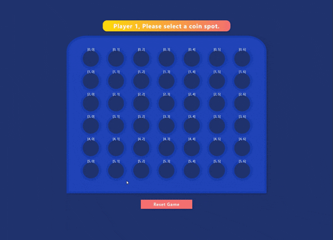

# Chingu Solo Project - Tier 2 - Connect4 Game

## Overview
This project lets you combine your UI/UX and programming skills to create a
fun two player game you might remember from childhood. It's also a great project 
to add to your portfolio since it gives you the opportunity to show off your 
design skills and to demonstrate your knowledge of how to efficiently handle 
events.

You can learn more about the history
and variations of this game in this 
[article](https://en.wikipedia.org/wiki/Connect_Four).

## About Chingu

If you aren’t yet a member of Chingu we invite you to join us. We help our 
members transform what they’ve learned in courses & tutorials into the 
practical experience employers need and want.

Our remote team projects let you refine your technical skills and put them 
into practice while gaining new “soft” skills like communication, 
collaboration, and Agile project management. The types of skills that 
help real-world teams get things done!

You can learn more and join us at [chingu.io](https://chingu.io).

## Instructions

For this project you may use any language or framework.

General instructions for all Solo Projects can also be found in the [Chingu
Library](https://voyage.docs.chingu.io/prework/howwork).

### Requirements

**Structure**
- [ ] Review the gameplay rules for Connect 4 before you begin designing and
developing your implementation.
- [ ] Setup the top-level parent component for the application. This component 
contains at least the following parts:
  - Game status display
  - Game board made up of 7 columns and 6 rows.
  - Game discs (you should have a single disc definition that you dynamically 
  replicate and attach to the DOM)
  - Reset Game button 

**Style**
- [ ] You may implement any style you choose. However, it should be consistent 
(e.g. font, font size, color scheme, layout, etc.).
  - See [Consistent Web Design](https://1stwebdesigner.com/consistent-web-design/)
  - See [Why is consistency important in Web Design?](https://laceytechsolutions.co.uk/blog/importance-of-consistency-in-web-design/)

**Functionality**
- [ ] Since Connect 4 is a turn-based bame the app should prompt each player
when it is their turn to play. Each player takes turns making one move per turn.
- [ ] Players should be distinguished as 'Player 1' and 'Player 2' in prompts
and messages.
- [ ] Each players disc should be uniquely distinguishable for the other players
disc.
- [ ] Clicking a cell in the board will drop a disc into that column.
- [ ] A player wins if they get four in a row horizontally, vertically, or 
diagonally (in any direction)
- [ ] A game is tied when the whole board is filled up.
- [ ] The game is over when the a player wins or the game is tied.
- [ ] Clicking the Game Reset button clears the game board and starts a new
game.

**Other**
- [ ] Your repo needs to have a robust `README.md` (see
[Keys to a Well-Written Readme](https://medium.com/chingu/keys-to-a-well-written-readme-55c53d34fe6d))
- [ ] Make sure that there are no errors in the developer console before 
submitting
- [ ] Deploy your website  
      Once you're done with the requirements and the console is free of 
      errors, deploy your application. You can use services like GitHub pages, 
      Netlify or Heroku. It's up to you! 
- [ ] Make your design fully responsive (see 
[Responsive Web Design Basics](https://developers.google.com/web/fundamentals/design-and-ux/responsive))

**Extras (Not Required)**
- [ ] Add a '?' button to display game rules
- [ ] Allow each player to enter the name they want to be referred to in
prompts and messages
- [ ] Allow players to select the color of their disc
- [ ] Allow players to select images rather than colors for their discs
- [ ] Anticipate and handle any edge cases
- [ ] Use Accessibility techniques (see 
[The A11Y Project](https://a11yproject.com/)) to improve your site for users 
with impairments 
